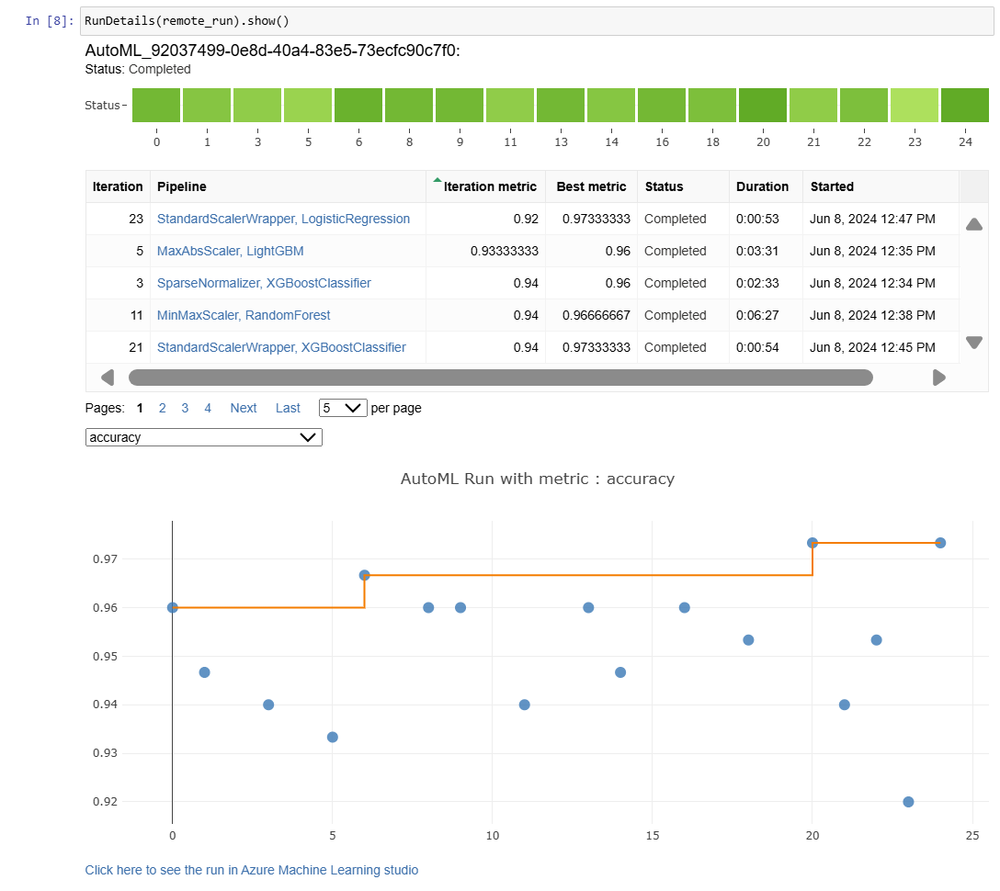
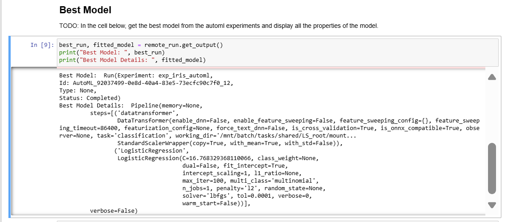
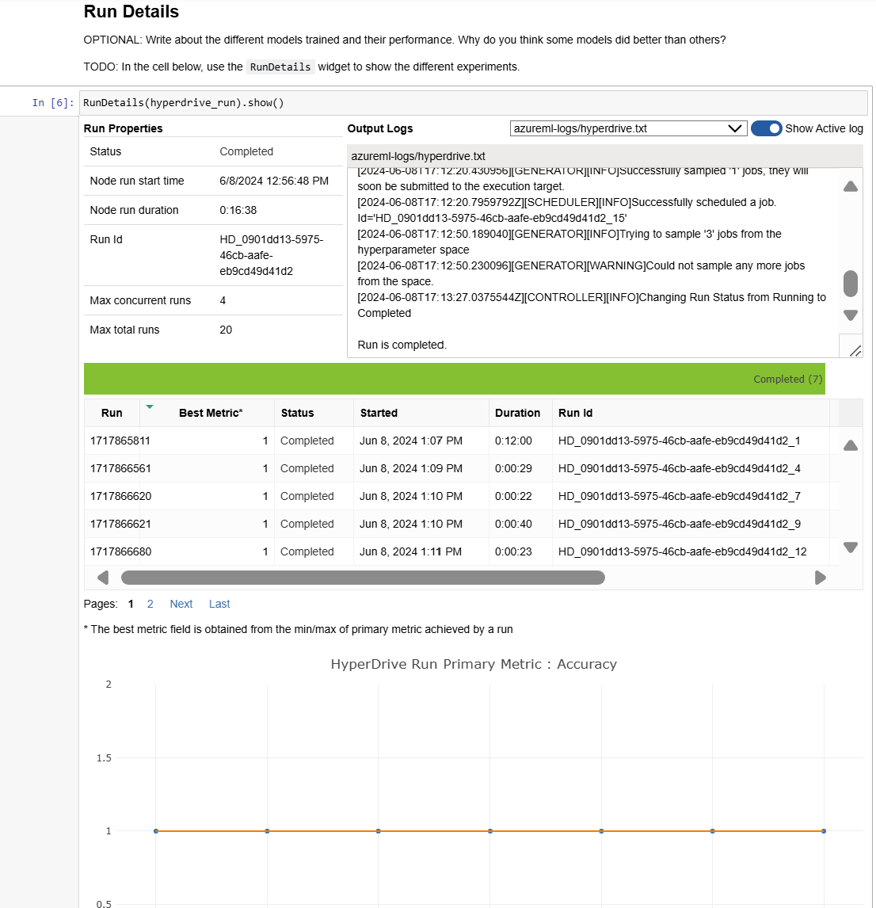
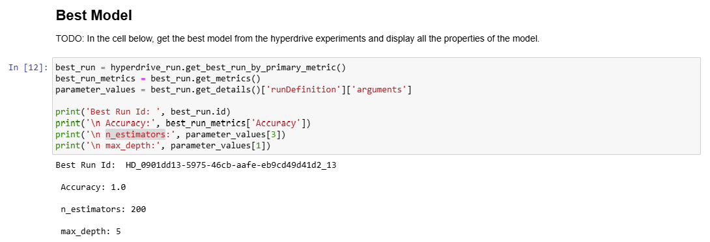

# Iris Flower Classification with Azure AutoML and HyperDrive

This project uses Azure Machine Learning's AutoML and HyperDrive to classify iris flower species based on their features. The primary objective is to find the best machine learning model for this classification task, and then deploy that model as a service endpoint.

## Dataset

### Overview
The dataset used is the Iris dataset, which contains 150 samples of iris flowers. Each sample is described by four features: sepal length, sepal width, petal length, and petal width. The target variable represents the species of the iris flower (Iris-setosa, Iris-versicolor, and Iris-virginica). Source: [Scikit-learn Iris Dataset](https://scikit-learn.org/stable/modules/generated/sklearn.datasets.load_iris.html#sklearn.datasets.load_iris).

### Task
The task is to use Azure AutoML to classify iris flower species based on their features. This involves:
- Loading and preparing the dataset.
- Registering the dataset in the AzureML workspace.
- Creating and running an AutoML experiment using the dataset.
- Saving the best model.

### Access
The data is accessed in the AzureML workspace by loading it from Scikit-learn and registering it as a dataset.

## Automated ML
The AutoML settings were chosen to efficiently find the best model for the classification task.
```python
automl_settings = {
    "iteration_timeout_minutes": 5,  # Each model iteration will run for a maximum of 5 minutes.
    "experiment_timeout_hours": 0.25,  # The entire experiment will run for a maximum of 15 minutes.
    "n_cross_validations": 5,  # Use 5-fold cross-validation to ensure model robustness.
    "primary_metric": 'accuracy',  # Optimize the model for accuracy.
    "enable_onnx_compatible_models": True  # Ensure models are ONNX-compatible for deployment.
}

automl_config = AutoMLConfig(
    task='classification',  # The task is classification based on the Iris dataset.
    training_data=iris_dataset,  # The dataset to be used for training.
    label_column_name='target',  # The column name of the target variable.
    compute_target='notebook260384',  # The compute target where the experiment will run.
    path='.',  # The directory to save outputs.
    **automl_settings  # Include the automl_settings.
)
```

### Results
The best model achieved an accuracy of 97.33%. The parameters of the best model can be viewed in the model's details below:
```python
Pipeline(memory=None,
         steps=[('datatransformer',
                 DataTransformer(enable_dnn=False, enable_feature_sweeping=False, feature_sweeping_config={}, feature_sweeping_timeout=86400, featurization_config=None, force_text_dnn=False, is_cross_validation=True, is_onnx_compatible=True, observer=None, task='classification'),
                 StandardScalerWrapper(copy=True, with_mean=True, with_std=False)),
                ('LogisticRegression',
                 LogisticRegression(C=16.768329368110066, class_weight=None,
                                    dual=False, fit_intercept=True,
                                    intercept_scaling=1, l1_ratio=None,
                                    max_iter=100, multi_class='multinomial',
                                    n_jobs=1, penalty='l2', random_state=None,
                                    solver='lbfgs', tol=0.0001, verbose=0,
                                    warm_start=False))],
         verbose=False)
```
To improve the model, we can experiment with longer timeout to let the AutoML try more hyperparamters and modeling techniques.

#### AutoML Run Details


#### Best Model Details


## Hyperparameter Tuning

The model chosen for hyperparameter tuning is a Random Forest Classifier. The hyperparameters "--n_estimators" and "--max_depth" were selected for tuning using Random Sampling to explore different model complexities.

```python
param_sampling = RandomParameterSampling({
    "--n_estimators": choice(50, 100, 150, 200),
    "--max_depth": choice(5, 10, 15, 20)
})
```

### Results
The best model achieved an accuracy of 100%. The optimal hyperparameters included 200 estimators and a max depth of 5. Future improvements could involve exploring different modeling techniques other than Random Forest Classifier; reducing the effect of overfitting since the model achieved 100% accuracy but can perform poorly with unseen data in the future.

#### HyperDrive Run Details


#### Best Model Details



## Model Deployment
The best model from HyperDrive experiment is deployed since it has the best accuracy.

Python code sample to query the endpoint:
```python
import urllib.request
import json
import os
import ssl

def allowSelfSignedHttps(allowed):
    # bypass the server certificate verification on client side
    if allowed and not os.environ.get('PYTHONHTTPSVERIFY', '') and getattr(ssl, '_create_unverified_context', None):
        ssl._create_default_https_context = ssl._create_unverified_context

allowSelfSignedHttps(True) # this line is needed if you use self-signed certificate in your scoring service.

# Request data goes here
# The example below assumes JSON formatting which may be updated
# depending on the format your endpoint expects.
# More information can be found here:
# https://docs.microsoft.com/azure/machine-learning/how-to-deploy-advanced-entry-script
data = {'data': [[5.1, 3.5, 1.4, 0.2]]}

body = str.encode(json.dumps(data))

url = 'http://674a9546-3b13-418d-be45-d6104cca7ab2.westeurope.azurecontainer.io/score'


headers = {'Content-Type':'application/json'}

req = urllib.request.Request(url, body, headers)

try:
    response = urllib.request.urlopen(req)

    result = response.read()
    print(result)
except urllib.error.HTTPError as error:
    print("The request failed with status code: " + str(error.code))

    # Print the headers - they include the requert ID and the timestamp, which are useful for debugging the failure
    print(error.info())
    print(error.read().decode("utf8", 'ignore'))

```

## Screen Recording
The link to the [screen recording](https://www.youtube.com/watch?v=DmYONVkRcR8) of the project in action. The screencast demonstrates:
- A working model
- Demo of the deployed  model
- Demo of a sample request sent to the endpoint and its response
